## Neural network for weather prediction (drizzle/fog/rain/snow/sun) based on independent variables (precipitation/maximum temperature/minimum temperature/wind).

### Data:
The data used to train the model was downloaded from www.kaggle.com.
They concern the city of Seattle (USA) from 2012-2015.
They contain basic weather information such as:
+ date,
+ precipitation,
+ maximum temperature,
+ minimum temperature,
+ weather condition (drizzle/fog/rain/snow/sun)

### Example usage:
1. Prediction of weather conditions for the city of Seattle in 2016-2023 - supplementing missing data.
2. Creating an application to predict weather in Seattle.

### Model used:
The model used in the project is a one-way neural network with the Back-Propagation algorithm.
It consists of 4 layers:
1. Input layer consisting of 64 neurons, f. activation: RELU
2. Hidden layer consisting of 32 neurons and f. RELU activation
3. Hidden layer consisting of 16 neurons and RELU activation
4. An output layer consisting of 5 neurons (because we have 5 types of weather that we try to predict)

#### Neural network visualization:

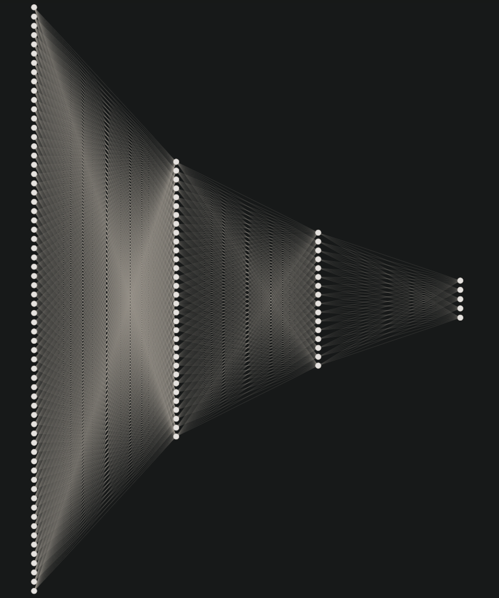

Visualization address: http://alexlenail.me/NN-SVG/index.html

#### Packages needed to create the model:

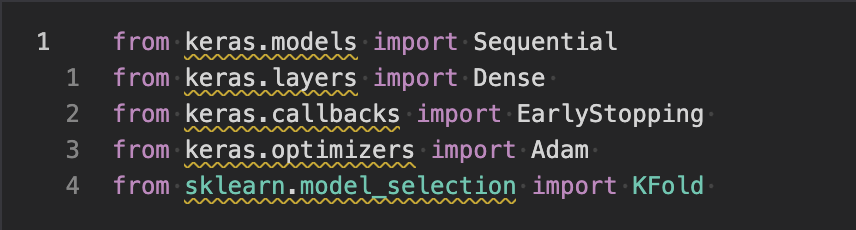

<details>
<summary>Show libraries</summary>

```python
from keras.models import Sequential
from keras.layers import Dense 
from keras.callbacks import EarlyStopping 
from keras.optimizers import Adam 
from sklearn.model_selection import KFold 
```
</details>

#### Creating a model and training it (including descriptions):

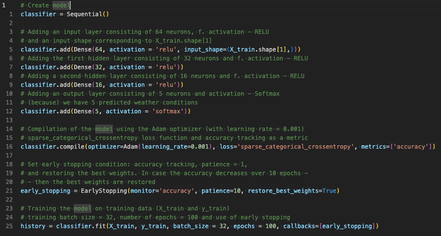

<details>
 <summary>Show model code</summary>

```python
# Create model
classifier = Sequential()

# Adding an input layer consisting of 64 neurons, f. activation - RELU
# and an input shape corresponding to X_train.shape[1]
classifier.add(Dense(64, activation = 'relu', input_shape=(X_train.shape[1],)))
# Adding the first hidden layer consisting of 32 neurons and f. activation - RELU
classifier.add(Dense(32, activation = 'relu'))
# Adding a second hidden layer consisting of 16 neurons and f. activation - RELU
classifier.add(Dense(16, activation = 'relu'))
# Adding an output layer consisting of 5 neurons and activation - Softmax
# (because) we have 5 predicted weather conditions
classifier.add(Dense(5, activation = 'softmax'))

# Compilation of the model using the Adam optimizer (with learning rate = 0.001)
# sparse_categorical_crossentropy loss function and accuracy tracking as a metric
classifier.compile(optimizer=Adam(learning_rate=0.001), loss='sparse_categorical_crossentropy', metrics=['accuracy'])

# Set early stopping condition: accuracy tracking, patience = 1,
# and restoring the best weights. In case the accuracy decreases over 10 epochs -
# - then the best weights are restored
early_stopping = EarlyStopping(monitor='accuracy', patience=10, restore_best_weights=True)

# Training the model on training data (X_train and y_train)
# training batch size = 32, number of epochs = 100 and use of early stopping
history = classifier.fit(X_train, y_train, batch_size = 32, epochs = 100, callbacks=[early_stopping])
```
</details>

#### Training chats
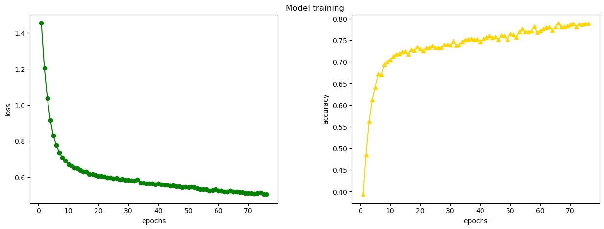

#### Confusion matrix for the above model:

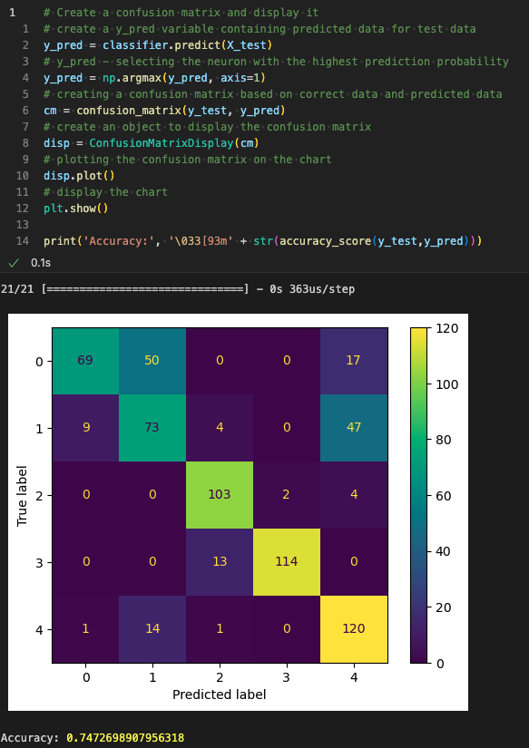

`Designations in the table: 0 - rain, 1 - fog, 2 - drizzle, 3 - sun, 4 - snow.`
<br>

It allows us to better visualize where our model got it right and where it got it wrong (and how). The `argmax()` method from the `numpy` library (in the `np.argmax()` code) is used to select the neuron with the highest recognition probability.
<br>
As you can also see in the screenshot above - the accuracy of the model is 72% (you can try to increase it by e.g. cross-validation).

<details>
<summary>Show confusion matrix code</summary>

```python
from sklearn.metrics import confusion_matrix, ConfusionMatrixDisplay, accuracy_score
# Create a confusion matrix and display it
# create a y_pred variable containing predicted data for test data
y_pred = classifier.predict(X_test)
# y_pred - selecting the neuron with the highest prediction probability
y_pred = np.argmax(y_pred, axis=1)
# creating a confusion matrix based on correct data and predicted data
cm = confusion_matrix(y_test, y_pred)
# create an object to display the confusion matrix
disp = ConfusionMatrixDisplay(cm)
# plotting the confusion matrix on the chart
disp.plot()
# display the chart
plt.show()

print('Accuracy:', '\033[93m' + str(accuracy_score(y_test,y_pred)))
```
</details>

#### Prediction for randomly selected 5 data points:

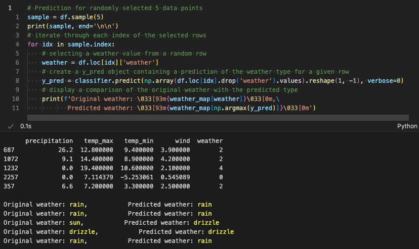

As you can see, the predictions are not optimistic, which is why cross-validation was used for this purpose.


<details>
<summary>Show prediction code</summary>

```python
# Prediction for randomly selected 5 data points
sample = df.sample(5)
print(sample, end='\n\n')
# iterate through each index of the selected rows
for idx in sample.index:
    # selecting a weather value from a random row
    weather = df.loc[idx]['weather']
    # create a y_pred object containing a prediction of the weather type for a given row
    y_pred = classifier.predict(np.array(df.loc[idx].drop('weather').values).reshape(1, -1), verbose=0)
    # display a comparison of the original weather with the predicted type
    print(f'Original weather: \033[93m{weather_map[weather]}\033[0m,\
           Predicted weather: \033[93m{weather_map[np.argmax(y_pred)]}\033[0m')
```
</details>


<br>

#### Cross-validation for better result (based on the same model):

<details>
<summary>Show cross validation target</summary>
Cross-validation allows you to divide the training and test sets in such a way as to repeatedly evaluate the model on different data samples.
<br>
There is a probability that when dividing the set into training and testing data, one class will be included in only one of the groups (e.g. only in the test set), which means that the model will be poorly able to recognize it.
<br>
For this purpose, a division into the so-called cross-validation, which allows the data to be divided into k-parts (5 parts were used in the project).
This allows you to go through the data set in such a way that the model is trained and evaluated k-times, in which the test set is different with each pass - this makes it possible to avoid the above-mentioned problems. problem.
The model itself also has a better ability to deal with a variety of data while avoiding overfitting.

<br>
The easiest way to understand this is in the photo below:

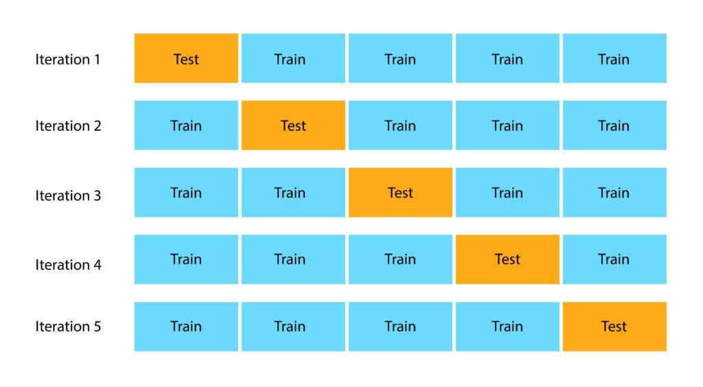

</details>
<br>

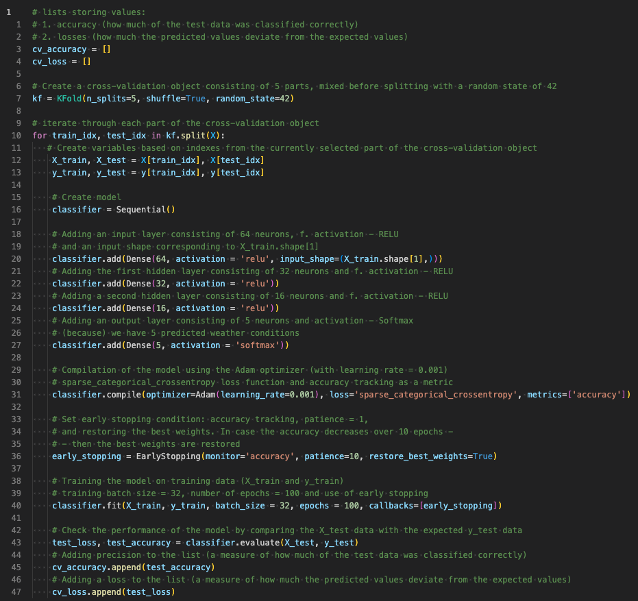

<details>
<summary>Show model code</summary>

```python
# lists storing values:
# 1. accuracy (how much of the test data was classified correctly)
# 2. losses (how much the predicted values ​​deviate from the expected values)
cv_accuracy = []
cv_loss = []

# Create a cross-validation object consisting of 5 parts, mixed before splitting with a random state of 42
kf = KFold(n_splits=5, shuffle=True, random_state=42)

# iterate through each part of the cross-validation object
for train_idx, test_idx in kf.split(X):
   # Create variables based on indexes from the currently selected part of the cross-validation object
    X_train, X_test = X[train_idx], X[test_idx]
    y_train, y_test = y[train_idx], y[test_idx]

    # Create model
    classifier = Sequential()

    # Adding an input layer consisting of 64 neurons, f. activation - RELU
    # and an input shape corresponding to X_train.shape[1]
    classifier.add(Dense(64, activation = 'relu', input_shape=(X_train.shape[1],)))
    # Adding the first hidden layer consisting of 32 neurons and f. activation - RELU
    classifier.add(Dense(32, activation = 'relu'))
    # Adding a second hidden layer consisting of 16 neurons and f. activation - RELU
    classifier.add(Dense(16, activation = 'relu'))
    # Adding an output layer consisting of 5 neurons and activation - Softmax
    # (because) we have 5 predicted weather conditions
    classifier.add(Dense(5, activation = 'softmax'))

    # Compilation of the model using the Adam optimizer (with learning rate = 0.001)
    # sparse_categorical_crossentropy loss function and accuracy tracking as a metric
    classifier.compile(optimizer=Adam(learning_rate=0.001), loss='sparse_categorical_crossentropy', metrics=['accuracy'])

    # Set early stopping condition: accuracy tracking, patience = 1,
    # and restoring the best weights. In case the accuracy decreases over 10 epochs -
    # - then the best weights are restored
    early_stopping = EarlyStopping(monitor='accuracy', patience=10, restore_best_weights=True)

    # Training the model on training data (X_train and y_train)
    # training batch size = 32, number of epochs = 100 and use of early stopping
    classifier.fit(X_train, y_train, batch_size = 32, epochs = 100, callbacks=[early_stopping])

    # Check the performance of the model by comparing the X_test data with the expected y_test data
    test_loss, test_accuracy = classifier.evaluate(X_test, y_test)
    # Adding precision to the list (a measure of how much of the test data was classified correctly)
    cv_accuracy.append(test_accuracy)
    # Adding a loss to the list (a measure of how much the predicted values ​​deviate from the expected values)
    cv_loss.append(test_loss)
```
</details>

#### Confusion matrix (after using cross-validation)

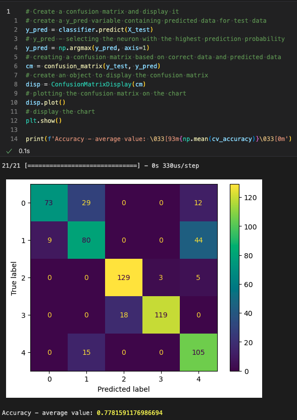

`Designations in the table: 0 - rain, 1 - fog, 2 - drizzle, 3 - sun, 4 - snow.`

<details>
<summary>Show confusion matrix code</summary>

```python
# Create a confusion matrix and display it
# create a y_pred variable containing predicted data for test data
y_pred = classifier.predict(X_test)
# y_pred - selecting the neuron with the highest prediction probability
y_pred = np.argmax(y_pred, axis=1)
# creating a confusion matrix based on correct data and predicted data
cm = confusion_matrix(y_test, y_pred)
# create an object to display the confusion matrix
disp = ConfusionMatrixDisplay(cm)
# plotting the confusion matrix on the chart
disp.plot()
# display the chart
plt.show()

print(f'Accuracy - average value: \033[93m{np.mean(cv_accuracy)}\033[0m')
```
</details>

#### Prediction for randomly selected 5 data points:

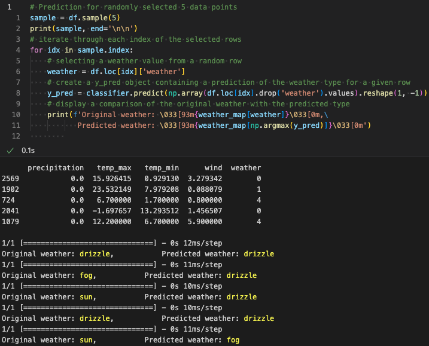

<details>
<summary>Show prediction code</summary>

```python
# Prediction for randomly selected 5 data points
sample = df.sample(5)
print(sample, end='\n\n')
# iterate through each index of the selected rows
for idx in sample.index:
    # selecting a weather value from a random row
    weather = df.loc[idx]['weather']
    # create a y_pred object containing a prediction of the weather type for a given row
    y_pred = classifier.predict(np.array(df.loc[idx].drop('weather').values).reshape(1, -1))
    # display a comparison of the original weather with the predicted type
    print(f'Original weather: \033[93m{weather_map[weather]}\033[0m,\
           Predicted weather: \033[93m{weather_map[np.argmax(y_pred)]}\033[0m')
```
</details>

#### Cross validation comment:
As you can see, the model after cross-validation will achieve greater accuracy <br>
It is currently achieving better results than before validation - which makes the model work much more effectively. <br>
The use of cross-validation had a positive and beneficial effect on the model's ability to generalize
affected the effectiveness of the model.

We can safely save the model trained in this way to a file in h5 format.

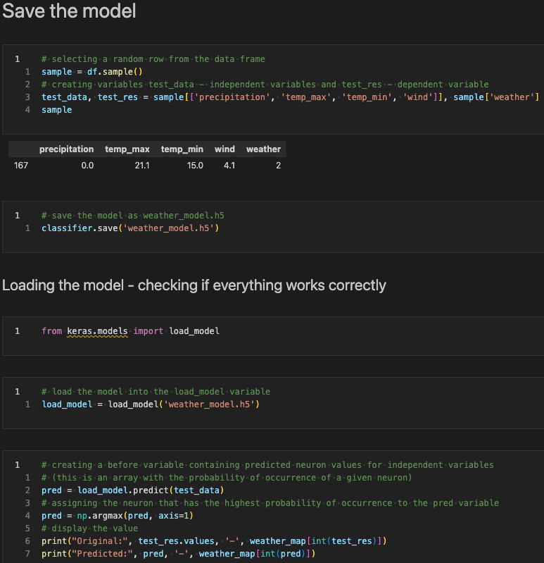

The screenshot above also shows the loading of the model and verification whether it was saved correctly, as well
whether it has not lost the parameters achieved in the learning process. <br>
As you can see, the model has been saved correctly and can handle randomly selected data.

### Summary
The main idea of ​​the project was to create a neural network based on the back-propagation algorithm,
as well as presenting the differences between the model trained `without` and `with`
using cross-validation.

Additionally, the project used various data processing techniques before training the model, such as:
+ data visualizations
+ completing data based on the average and standard deviation (to equalize the number of records from each class - to prevent overfitting of the model)
+ recoding class names into numerical variables ((using LabelEncoder) because models are trained on numerical data)
+ feature scaling - to also prevent model overfitting ((using StandardScaler) as neural networks are prone to overfitting)

The model achieved satisfactory results, and the project itself allowed for a better understanding of the operation of neural networks.